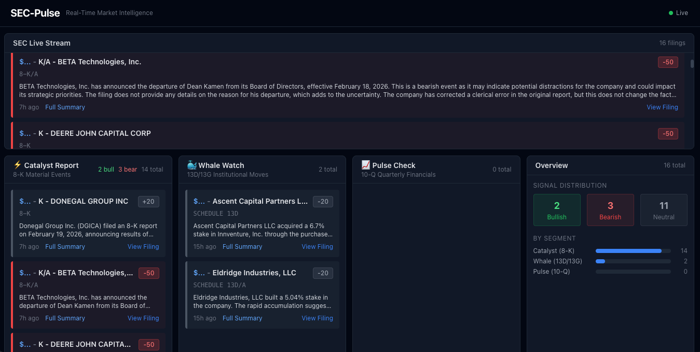
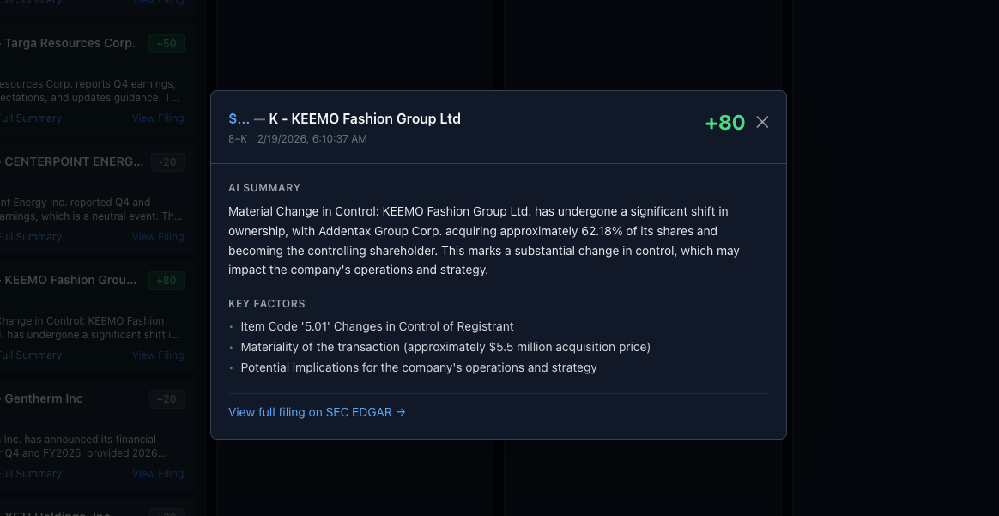

# SEC-Pulse — Real-Time Market Intelligence Dashboard

SEC-Pulse monitors the SEC EDGAR live feed and uses a local AI model (via Ollama) to instantly analyze new filings, score them on a -100 to +100 impact scale, and surface the signal through a real-time dashboard.

⚠️ Disclaimer
This tool is for educational and research purposes only. It is not intended to be financial advice. The "Impact Scores" and summaries are generated by a local Large Language Model and may contain inaccuracies. Always perform your own due diligence and consult with a certified financial advisor before making investment decisions.



---

## What It Does

Every 5 seconds the backend polls the SEC EDGAR Atom feed for new filings. When a relevant filing arrives it is:

1. **Parsed** — structured data is extracted (item codes, financials, ownership percentages, etc.)
2. **Pre-classified** — a fast heuristic gives an immediate numeric signal
3. **AI-analyzed** — a local LLM reads the full text and returns a JSON report with a summary, impact score, and reasons
4. **Broadcast** — the result is pushed to the frontend in real time via WebSocket

The dashboard shows three focused segments:

| Panel | SEC Form | What It Catches |
|---|---|---|
| **Catalyst** | 8-K | Material events — earnings, M&A, management exits, auditor changes, regulatory actions |
| **Whale Watch** | 13D / 13G | Institutional stake-building, activist investor campaigns, passive accumulation crosses |
| **Pulse Check** | 10-Q | Quarterly earnings — revenue trends, margin pressure, cash flow red flags, new risk factors |

Each filing card displays:
- Company ticker and name
- Form type
- AI-generated summary (2-line preview, expandable)
- Impact score badge (`+75` green / `-40` red / `0` gray)
- Signal reasons (bulleted rationale from the model)
- Filing timestamp and processing latency
- Direct link to the SEC EDGAR document

---

## Architecture

```
SEC EDGAR Atom Feed (every 5s)
        │
        ▼
  feed_poller.py          ← dedup, parse, dispatch
        │
        ├── form_8k.py    ← extract item codes
        ├── form_13d_13g.py ← ownership %, strategy
        └── form_10q.py   ← financials, iXBRL, sentiment
        │
        ▼
  alpha_engine.py         ← heuristic pre-score
        │
        ▼
  ai_processor.py         ← Ollama LLM (chunked, consolidated)
        │
        ▼
  SQLite (secpulse.db)    ← persist FilingRow
        │
        ▼
  WebSocket /ws/filings   ← broadcast to browser
        │
        ▼
  React Dashboard         ← 3 segment panels + live stream
```

---

## Requirements

### System

- **Python 3.11+**
- **Node.js 18+** (with npm)
- **Ollama** — [ollama.com](https://ollama.com) — runs the local LLM

### Python packages (backend)

```
fastapi, uvicorn, httpx[http2], feedparser, sqlalchemy[asyncio],
aiosqlite, pydantic-settings, edgartools, python-dateutil,
beautifulsoup4, lxml, pytest, pytest-asyncio
```

### Node packages (frontend)

```
react, react-dom, lucide-react, typescript, tailwindcss, vite
```

---

## Installation

### 1. Clone the repo

```bash
git clone <repo-url>
cd SecDashboard
```

### 2. Install Ollama

**macOS / Linux:**
```bash
curl -fsSL https://ollama.com/install.sh | sh
```

**Windows:** Download the installer from [ollama.com/download](https://ollama.com/download)

Then pull your chosen model (see [Model Recommendations](#model-recommendations) below):
```bash
ollama pull llama3.2:3b-instruct-q8_0
```

### 3. Set up the backend

```bash
cd backend
python -m venv venv
source venv/bin/activate        # Windows: venv\Scripts\activate
pip install -r requirements.txt
```

### 4. Set up the frontend

```bash
cd frontend
npm install
```

---

## Configuration

The backend reads settings from `backend/.env` (create it if it doesn't exist). All fields are optional — defaults work out of the box.

```env
# SEC EDGAR polite-access header (required by SEC — use your own contact info)
SEC_USER_AGENT="YourName Dashboard your@email.com"

# Ollama
OLLAMA_BASE_URL=http://localhost:11434
OLLAMA_MODEL=llama3.2:3b-instruct-q8_0

# Polling
POLL_INTERVAL_SECONDS=5

# Limits
FILING_TEXT_MAX_CHARS=20000
SLM_TIMEOUT_SECONDS=180
MAX_CONCURRENT_DOWNLOADS=8
```

---

## Running the Dashboard

You need three things running: Ollama, the backend, and the frontend.

### Terminal 1 — Ollama

```bash
ollama serve
```

Ollama is already running if you installed it as a macOS app. You can verify at `http://localhost:11434`.

### Terminal 2 — Backend

```bash
cd backend
source venv/bin/activate        # Windows: venv\Scripts\activate
uvicorn app.main:app --reload --port 8000
```

On first run, `secpulse.db` is created automatically. The poller starts immediately.

### Terminal 3 — Frontend

```bash
cd frontend
npm run dev
```

Open `http://localhost:5173` in your browser.

---

## Model Recommendations

The right model depends entirely on your hardware. The LLM must run fast enough to keep up with filing volume — SEC EDGAR sees hundreds of filings per hour during market hours.

### Apple Silicon (M1 / M2 / M3 / M4)

All inference runs on the Neural Engine / GPU. Excellent performance even on base models.

| RAM | Recommended Model | Notes |
|---|---|---|
| 8 GB | `llama3.2:3b-instruct-q4_K_M` | Fast, good quality, fits comfortably |
| 16 GB | `llama3.2:3b-instruct-q8_0` *(default)* | Best quality at 3B, ~2–4s per filing |
| 16 GB | `mistral:7b-instruct-q4_K_M` | Stronger reasoning, ~5–8s per filing |
| 32 GB+ | `llama3.1:8b-instruct-q8_0` | Top quality, handles long 10-Q chunks well |

### Intel / AMD CPU only (no GPU)

CPU inference is significantly slower. Prioritize the smallest quantization.

| RAM | Recommended Model | Notes |
|---|---|---|
| 8 GB | `qwen2.5:1.5b` | Very fast, minimal quality |
| 16 GB | `llama3.2:3b-instruct-q4_K_M` | Acceptable quality, ~10–20s per filing |
| 32 GB | `mistral:7b-instruct-q4_K_M` | Good quality but slow (~30–60s) |

### NVIDIA GPU (CUDA)

| VRAM | Recommended Model | Notes |
|---|---|---|
| 4 GB | `llama3.2:3b-instruct-q4_K_M` | Full GPU offload |
| 8 GB | `llama3.2:3b-instruct-q8_0` or `mistral:7b-q4` | Sweet spot for quality/speed |
| 12 GB+ | `llama3.1:8b-instruct-q8_0` | Excellent throughput |
| 24 GB+ | `mistral-nemo:12b` or `llama3.1:70b-q2` | Research-grade quality |

### Switching models

```bash
# Pull the model
ollama pull mistral:7b-instruct-q4_K_M

# Set it in backend/.env
OLLAMA_MODEL=mistral:7b-instruct-q4_K_M

# Restart the backend
```

> **Tip:** If the model is too slow, the backend falls back to the heuristic pre-score automatically. You'll still get a numeric signal and a basic summary — just without the deep AI analysis.

---

## Possible Uses

**Active traders / day traders**
Monitor 8-K filings in real time to catch material events (earnings surprises, M&A, CEO departures, regulatory actions) seconds after they hit EDGAR — before news services pick them up.

**Activist / event-driven investors**
Whale Watch surfaces 13D/13G filings the moment a known activist or institution crosses a disclosure threshold. Spot accumulation campaigns early.

**Fundamental analysts**
Pulse Check processes each 10-Q and flags cash flow gaps, margin pressure, and new risk factors — useful for monitoring a watchlist without reading every filing manually.

**Quant / algo research**
The `/api/filings` REST endpoint and `/ws/filings` WebSocket can feed downstream pipelines. Impact scores and signal reasons are machine-readable JSON.

**Education / learning**
Study how specific 8-K item codes translate to market reactions, or how activist language in 13D Item 4 differs from passive 13G filings.

---

## API Reference

### REST

| Method | Endpoint | Description |
|---|---|---|
| `GET` | `/api/filings` | List filings. Params: `segment`, `signal`, `limit`, `offset` |
| `GET` | `/api/stats` | Aggregated stats for the last 24 hours |

**Example:**
```bash
# Get the 20 most recent catalyst filings
curl "http://localhost:8000/api/filings?segment=catalyst&limit=20"
```

### WebSocket

Connect to `ws://localhost:8000/ws/filings` to receive live events:

```json
// Filing detected, AI running
{ "type": "filing_processing", "data": { "accession_number": "...", "company_name": "...", "segment": "catalyst", ... } }

// AI complete, full result
{ "type": "new_filing", "data": { "id": 42, "impact": 75, "summary": "...", "signal_reasons": [...], ... } }
```

---

## Resetting the Database

If you change the DB schema, delete the SQLite file and restart:

```bash
rm backend/secpulse.db
```

The schema is recreated automatically on the next startup.

---

## Project Structure

```
SecDashboard/
├── backend/
│   ├── app/
│   │   ├── main.py              # FastAPI app, lifespan, CORS
│   │   ├── models.py            # SQLAlchemy ORM + Pydantic schemas
│   │   ├── config.py            # Settings (reads .env)
│   │   ├── database.py          # Async SQLite session
│   │   ├── routers/
│   │   │   ├── filings.py       # GET /api/filings, /api/stats
│   │   │   └── ws.py            # WebSocket /ws/filings
│   │   ├── services/
│   │   │   ├── feed_poller.py   # SEC EDGAR polling loop
│   │   │   ├── filing_fetcher.py # Download + route to parser
│   │   │   ├── ai_processor.py  # Ollama integration, chunking
│   │   │   └── alpha_engine.py  # Heuristic pre-classifier
│   │   ├── parsers/
│   │   │   ├── form_8k.py       # 8-K item code extraction
│   │   │   ├── form_13d_13g.py  # Ownership %, strategy detection
│   │   │   └── form_10q.py      # Financials, iXBRL, sentiment
│   │   └── prompts/
│   │       ├── catalyst.txt     # 8-K analyst prompt
│   │       ├── whale.txt        # 13D/13G analyst prompt
│   │       └── pulse.txt        # 10-Q analyst prompt
│   └── requirements.txt
└── frontend/
    └── src/
        ├── components/
        │   ├── Dashboard.tsx    # Main layout
        │   ├── SegmentPanel.tsx # Per-segment filing panel
        │   ├── FilingCard.tsx   # Individual filing card
        │   ├── LiveStream.tsx   # Chronological live feed
        │   ├── StatsPanel.tsx   # Signal distribution overview
        │   ├── SummaryModal.tsx # Full filing detail modal
        │   └── SignalBadge.tsx  # Impact score badge
        ├── hooks/
        │   ├── useWebSocket.ts  # WS + REST data management
        │   └── useNotifications.ts # Browser push notifications
        └── types/
            └── filing.ts        # TypeScript types + helpers
```
